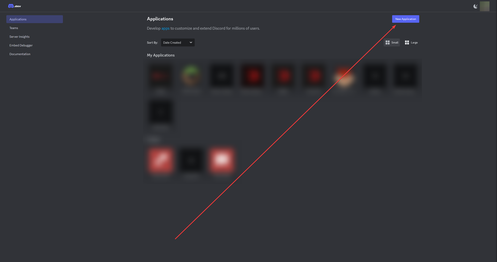
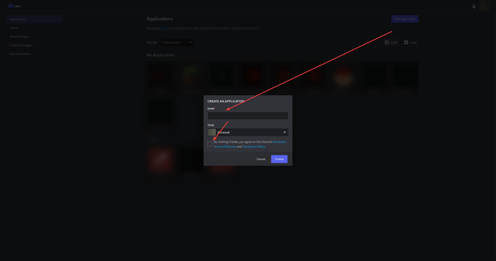
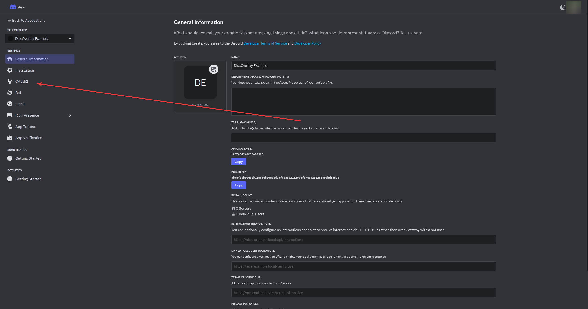
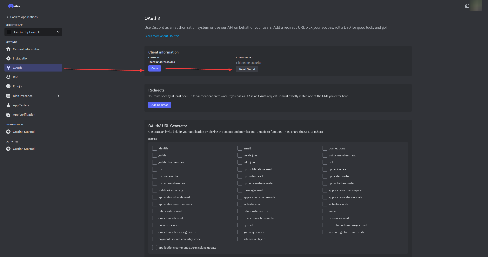
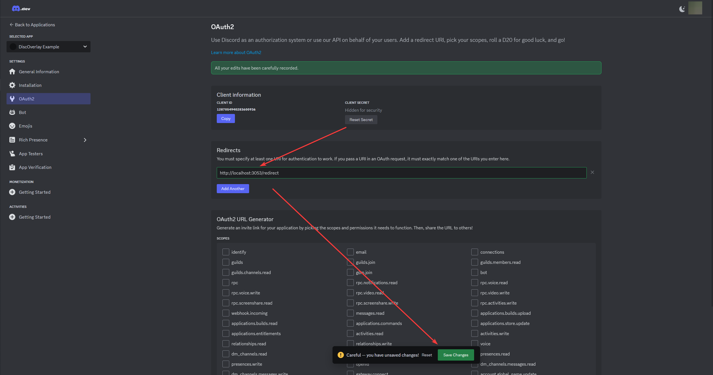

# DiscOverlay

DiscOverlay is an app that provides native overlay windows displaying Discord info. It shows information like who is currently in the user's connected voice channel and the voice states of those users. A message overlay feature, similar to Discord's StreamKit, is also being developed to enhance its capabilities.

There are several options for customization, such as changing which users are displayed, what information about them is shown and what other channel information is displayed. There is also a custom CSS option for those who want to further customize the appearance of the overlay.

---

---

## Setup

### Creating your Discord developer application

Navigate to the Discord developer portal create a new developer application

Create an application. This can be named whatever you like and can be within whatever team you would like. If you don’t know what the teams mean, just leave it on “Personal”

### Setting up your client

Once you’re taken to your new developer app’s page, navigate to the “OAuth2” tab

Copy your Client ID and (reset and) Client Secret, then input both into the fields below

Finally, click “Add Redirect” and input http://localhost:3053/redirect into the redirect input, then save your changes

---

---

**This project is licensed under [LGPL-3.0][lgpl]**\
**&copy; 2024 Deftu**

[lgpl]: https://www.gnu.org/licenses/lgpl-3.0.en.html
